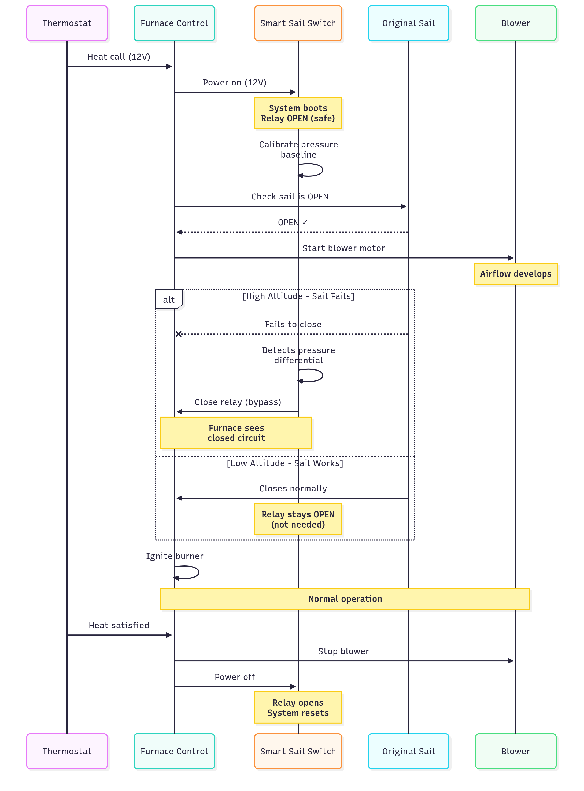
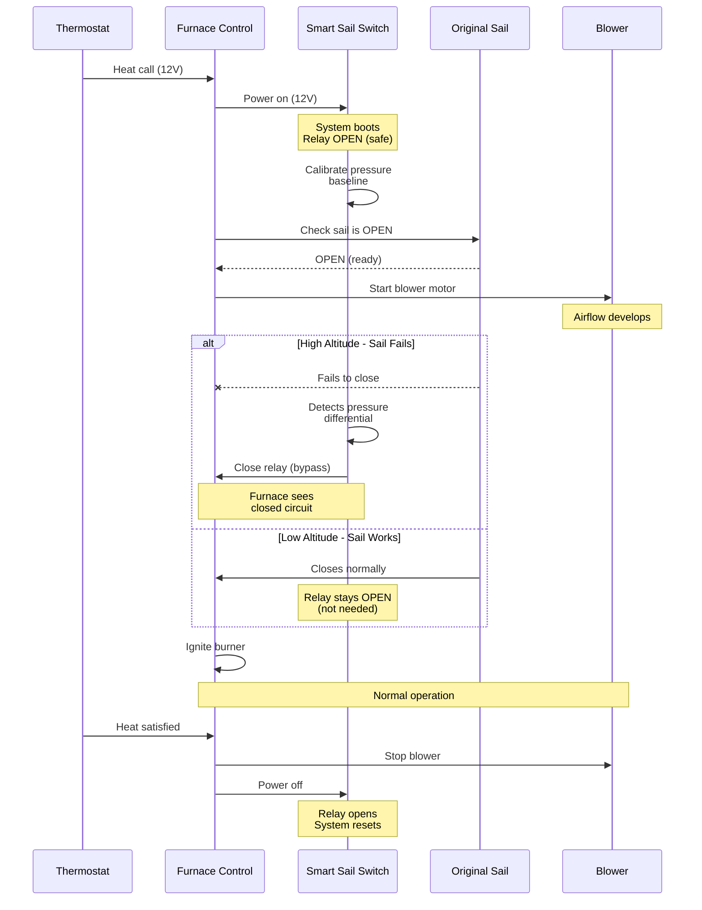

# Smart Sail Switch

An intelligent sail switch bypass for RV furnaces operating at high altitude using differential pressure sensing.

## Overview

This project provides a safety-conscious solution for RV furnaces (Dometic/Atwood HydroFlame) that fail to operate reliably at high altitudes. At elevations above 6,000ft, thinner air may not provide enough force to close the mechanical sail switch, preventing the furnace from igniting even when proper airflow exists.

The Smart Sail Switch uses a differential pressure sensor (MPXV5004DP) to directly measure blower airflow and intelligently bypass a failed sail switch only when safe conditions are confirmed.

## Project Status

**[WARNING] WORK IN PROGRESS - NOT YET COMPLETE**

This project is actively under development and testing. The firmware and hardware design are functional in simulation but have not been fully validated in real-world RV furnace installations. Do not install this in your RV until testing is complete and this notice is removed.

## Key Features

- **Hybrid Design**: Works in parallel with the original sail switch (doesn't remove factory safety)
- **Fail-Safe Operation**: System starts open (safe state), only closes when airflow is confirmed
- **Zero Power Draw**: Only active when furnace is called for heat
- **Smart Detection**: Monitors blower state, pressure differential, and original sail switch status
- **Auto-Calibration**: Calibrates pressure baseline at each heat cycle start
- **Visual Indicators**: LED status indicators for troubleshooting

## Important Safety Warning

**This modification bypasses a factory-installed safety feature.**

Even with multiple fail-safes and the hybrid design keeping the original sail switch in place, there are inherent risks including CO buildup, fire, or equipment damage if not implemented correctly.

- This project is provided for educational purposes
- Test extensively in controlled conditions
- Monitor for issues with a CO detector
- **Consult a qualified RV technician before installation**
- **Use at your own risk**

See [SAFETY.md](SAFETY.md) for complete safety information.

## Documentation

### Getting Started
- **New to Arduino/ATtiny?** Start with [docs/01-getting-started.md](docs/01-getting-started.md)
- [Hardware Overview](hardware/README.md) - Circuit design and components
- [Complete Parts List](hardware/parts-list.md) - Bill of materials (~$30-40)

### Development Setup
- **Recommended**: [CLion + PlatformIO + Wokwi Setup](docs/02-development-setup.md) - Modern IDE with simulation
- Alternative: [Arduino IDE Setup](docs/02-arduino-setup.md) - Traditional Arduino IDE approach
- **Quick Deploy**: Use the [deployment scripts](scripts/README.md) to build and upload firmware via USBtinyISP

### Build Guides
1. [Building the Circuit](docs/03-building.md) - Breadboard and permanent assembly
2. [Programming the ATtiny85](docs/04-programming.md) - Uploading firmware via USBtiny
3. [Testing](docs/05-testing.md) - Bench testing before installation
4. [Installation](docs/06-installation.md) - Installing in your RV furnace
5. [Troubleshooting](docs/07-troubleshooting.md) - Common issues and solutions

## Quick Specs

- **Microcontroller**: ATtiny85 (8MHz internal clock)
- **Pressure Sensor**: MPXV5004DP (0-3.92 kPa differential)
- **Power**: 12V from furnace thermostat line (stepped to 5V)
- **Output**: 5V relay module (isolated switching)
- **Current Draw**: ~50mA when active, 0mA when furnace off

## How It Works






**Operation Steps:**
1. Thermostat calls for heat -> Smart Sail Switch powers up
2. System calibrates pressure baseline (blower not yet running)
3. Furnace control board checks original sail switch is open
4. Blower motor starts
5. **At high altitude**: Original sail may fail to close, but Smart Sail Switch detects pressure differential and closes relay
6. Control board sees closed sail circuit -> proceeds with ignition
7. On heat cycle end, relay opens and system powers down

## Repository Structure

```
├── src/                   ATtiny85 firmware (PlatformIO)
├── scripts/               Build and deployment scripts for USBtinyISP
├── hardware/              Schematics, wiring diagrams, parts list
├── docs/                  Step-by-step build and installation guides
├── images/                Circuit diagrams and photos
├── diagram.json           Wokwi simulation circuit
└── platformio.ini         Build configuration
```

## License

CC BY-NC-SA 4.0 (Creative Commons Attribution-NonCommercial-ShareAlike) - See [LICENSE](LICENSE) file for details.

**Non-commercial use only.** This design may not be used for commercial purposes.

## Contributing

Contributions welcome! Open an issue or pull request on [GitHub](https://github.com/miclip/smart-rv-sail-switch).


## Disclaimer

This project modifies safety-critical RV equipment. The authors and contributors provide this information as-is with no warranties. You assume all risks and responsibilities for any modifications to your RV furnace system.
