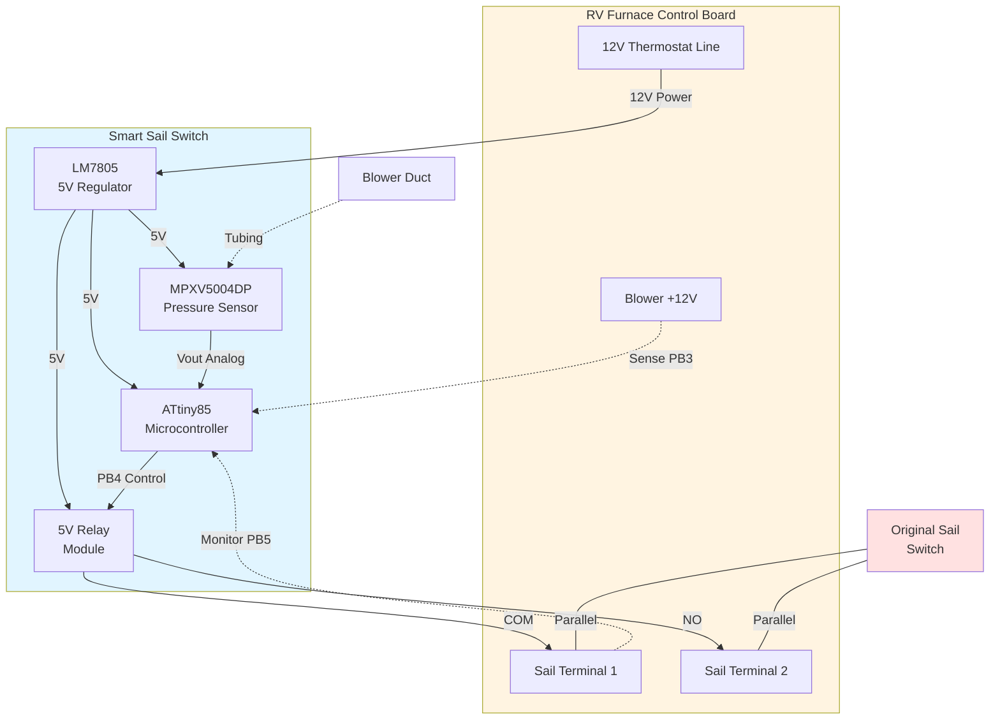

# Hardware Overview

This document describes the circuit design for the Smart RV Sail Switch.

## Circuit Diagram

```
RV Furnace 12V (Thermostat Line)
         |
         +---[10uF]---[LM7805]---[10uF]--- 5V Rail
         |             |                     |
         |            GND                    +-- ATtiny85 VCC (pin 8)
         |                                   +-- MPXV5004DP VCC
         |                                   +-- Relay Module VCC
         |
         +---[20K]---+--- PB3 (Blower Sense)
         |           |
        GND      [10K]---GND

Blower Motor 12V ---[20K]---+--- PB5 (Sail Sense)
(after sail switch)          |
                         [10K]---GND

MPXV5004DP Vout --- PB2 (ADC Input)

ATtiny PB4 ---[1K]--- Relay IN
(pin 3)

Relay Contacts:
  COM --- Original Sail Terminal 1
  NO  --- Original Sail Terminal 2
  (Parallel with original sail switch)
```

## Block Diagram



## Power Supply Section

### Purpose
Convert furnace's 12V to regulated 5V for microcontroller and sensor.

### Components
- **Input**: 12V from thermostat line (only live during heat call)
- **Regulator**: LM7805 (TO-220) or LM1117-5.0 (SOT-223)
- **Input Cap**: 10uF electrolytic (noise filtering)
- **Output Cap**: 10uF electrolytic (stability)
- **Decoupling**: 0.1uF ceramic near ATtiny85

### Why Switched Power?
- **Zero parasitic draw** when furnace is off
- **Auto-calibration** on each boot (new heat cycle)
- **Prevents battery drain** during RV storage

### Voltage Regulation
- Input: 10-14.5V (typical RV battery range)
- Output: 5.0V ±5%
- Current draw: ~50mA typical, <100mA peak
- Heat dissipation: Minimal (use small heatsink on LM7805 recommended)

## Input Sensing Section

### Blower Detection (PB3)
**Purpose**: Detect when furnace has energized the blower motor.

**Circuit**:
- Tap 12V from blower motor positive wire
- Voltage divider: 20K (top) / 10K (bottom)
- Output to PB3: ~4V when blower on, 0V when off

**Why?** Know when to expect airflow (don't look for pressure before blower starts).

### Original Sail Monitoring (PB5) - Hybrid Mode
**Purpose**: Monitor if original sail switch closed successfully.

**Circuit**:
- Tap wire after sail switch (before limit switch input on control board)
- Voltage divider: 20K / 10K
- Output to PB5: ~4V if sail closed, 0V if open

**Logic**: Only bypass if airflow detected BUT sail didn't close.

### Pressure Sensor (PB2 - ADC)
**Purpose**: Measure differential pressure = airflow

**MPXV5004DP Connections**:
- Pin 1 (Vout): to ATtiny PB2
- Pin 2 (GND): to ground
- Pin 3 (VCC): to 5V
- Pin 4 (P1): Pressure port - connect tubing to blower duct
- Pin 5 (P2): Reference port - leave open to ambient air
- Pin 6 (P3): Not used (second differential port)

**Output Voltage**:
- No airflow (0 kPa): ~1.0V (ADC ~205)
- Typical blower (0.3 kPa): ~1.24V (ADC ~254)
- Maximum (3.92 kPa): ~4.1V (ADC ~840)

**Tubing**:
- Use 1/8" ID silicone tubing (flexible, temperature resistant)
- Length: 1-3 feet (minimize restriction)
- Route away from hot surfaces
- Secure with zip ties to prevent disconnection

## Output Control Section

### Relay Module
**Purpose**: Isolate low-voltage control (5V) from furnace circuit (12V).

**Specifications**:
- Coil voltage: 5V DC
- Contacts: SPDT (Single Pole, Double Throw) or SPST-NO
- Contact rating: 10A at 12V DC minimum
- Opto-isolation: Recommended (protects ATtiny from back-EMF)
- Trigger: Active-high (relay closes when signal HIGH)

**Wiring**:
- Relay Module IN: to ATtiny PB4 (through 1K resistor if not on module)
- Relay Module VCC: to 5V
- Relay Module GND: to ground
- Relay COM: to one sail switch terminal
- Relay NO: to other sail switch terminal

**Hybrid Configuration**:
- Relay contacts in PARALLEL with original sail switch
- If original sail works -> it closes the circuit (relay stays open)
- If original sail fails -> relay can close the circuit (bypass)

## Status LEDs (Optional but Recommended)

### Red LED (PB1) - Idle/Error
- **Solid ON**: System idle, waiting for heat call
- **Fast blink (4 Hz)**: Sensor error - check connections
- **Off**: Blower running (normal operation mode)

### Green LED (PB0) - Active/Bypass
- **Off**: Normal operation (original sail working or no bypass needed)
- **Solid ON**: Actively bypassing (relay closed due to failed sail)

### LED Circuit
```
PB1 or PB0 ---[220-330Ω]---[LED]--- GND
                resistor    (anode -> cathode)
```

## ATtiny85 Pin Summary

| Pin # | Name | Direction | Purpose |
|-------|------|-----------|---------|
| 1 | RESET | - | (Leave unconnected or tie to VCC via 10K) |
| 2 | PB3 | Input | Blower sense (voltage divider from blower 12V) |
| 3 | PB4 | Output | Relay control (HIGH = close relay) |
| 4 | GND | Power | Ground |
| 5 | PB0 | Output | Green LED (active indicator) |
| 6 | PB1 | Output | Red LED (idle/error indicator) |
| 7 | PB2 | Input (ADC) | Pressure sensor Vout (analog) |
| 8 | VCC | Power | 5V from regulator |

## PCB Layout Recommendations

### Breadboard Testing
1. Build on breadboard first for testing
2. Use IC socket for ATtiny85 (easy to swap/reprogram)
3. Keep wires short to reduce noise on ADC
4. Twist pair or shield the sensor wire

### Permanent Build (Perfboard)
1. **Component placement**:
   - Voltage regulator at edge (heatsink access)
   - ATtiny85 in center (minimize wire lengths)
   - Relay module on opposite edge from regulator
   - Sensor connector accessible

2. **Grounding**:
   - Use thick wire or copper tape for ground bus
   - Star ground configuration (all grounds to one point)
   - Separate analog ground if possible

3. **Decoupling**:
   - 0.1uF ceramic cap RIGHT at ATtiny VCC/GND pins
   - Short leads, close placement

4. **Wire routing**:
   - Sensor signal away from relay coil (noise source)
   - Power wires thick (18-20 AWG for 12V input)
   - Signal wires can be thinner (22-26 AWG)

## Enclosure

### Requirements
- **Size**: 4" x 3" x 2" minimum (accommodate relay and regulator)
- **Material**: Plastic (non-conductive)
- **Rating**: IP65 recommended (dust/moisture protection)
- **Clear top**: Optional but helpful to see LED status
- **Cable glands**: 2-3 for weatherproof wire entry
- **Mounting**: Vibration-resistant screws, secure to furnace compartment

### Layout Inside Enclosure
```
┌─────────────────────────────┐
│ [LED indicators visible]    │ <- Clear window or light pipes
│                             │
│  ┌──────┐   ┌──────────┐    │
│  │ Relay│   │  Voltage │    │
│  │Module│   │Regulator │    │
│  └──┬───┘   └──────┬───┘    │
│     │              │        │
│  ┌──▼──────────────▼─────┐  │
│  │    Circuit Board      │  │
│  │    (Perfboard)        │  │
│  └───────────────────────┘  │
│                             │
│ [Wire entry glands]         │
└─────────────────────────────┘
```

## Next Steps

1. Review [parts-list.md](parts-list.md) for components
2. Follow [../docs/03-building.md](../docs/03-building.md) for assembly instructions
3. Test circuit before permanent installation

## Schematic Files

Detailed schematic diagrams will be added to `images/schematic.png` and potentially KiCad or Fritzing files for those who want to design a custom PCB.

## Questions?

Open an issue on GitHub if you need clarification on any circuit details!
