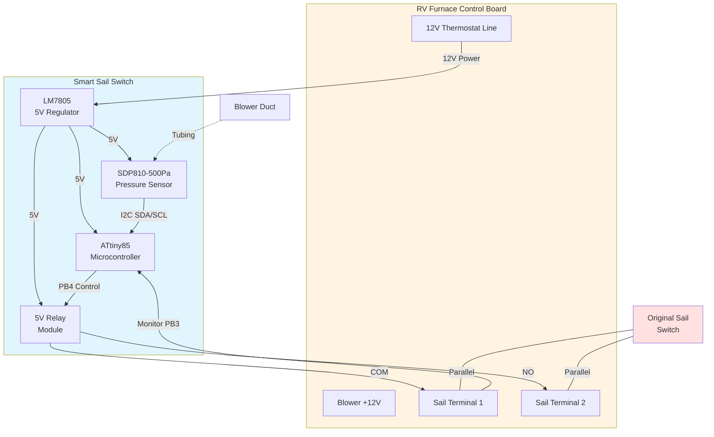

# Hardware Overview

This document describes the circuit design for the Smart RV Sail Switch.

## Circuit Diagram

```
RV Furnace 12V (Thermostat Line)
         |
         +---[100nF]---[L7805]---[100nF+100uF]--- 5V Rail
         |              |                           |
         |             GND                          +-- ATtiny85 VCC (pin 8)
         |                                          +-- SDP810 VDD
         |                                          +-- Relay Module VCC
         |
         +---[10K]---+--- PB3 (Sail Switch Input)
                     |
                    GND

SDP810 I2C:
  SDA --- PB0 (with 4.7K pull-up to 5V)
  SCL --- PB2 (with 4.7K pull-up to 5V)

ATtiny85 PB4 --- Relay Module Signal (IN)
(pin 3)

ATtiny85 PB0 --- [220Ω] --- Green LED --- GND
(pin 5)

ATtiny85 PB1 --- [220Ω] --- Red LED --- GND
(pin 6)

Relay Contacts:
  COM --- Original Sail Terminal 1
  NO  --- Original Sail Terminal 2
  (Parallel with original sail switch)

ISP Programming Header (2x3):
  1 (MISO) --- PB1
  2 (VCC)  --- 5V
  3 (SCK)  --- PB2
  4 (MOSI) --- PB0
  5 (RST)  --- PB5 (pin 1)
  6 (GND)  --- GND
```

## Block Diagram



## Power Supply Section

### Purpose
Convert furnace's 12V to regulated 5V for microcontroller and sensor.

### Components
- **Input**: 12V from thermostat line (only live during heat call)
- **Regulator**: L7805CV-DG (TO-220)
- **Input Cap**: 100nF ceramic (noise filtering)
- **Output Caps**: 100nF ceramic + 100µF electrolytic (stability and ripple reduction)
- **PCB**: Custom PCB from JLCPCB with SMD assembly for resistors and caps

### Why Switched Power?
- **Zero parasitic draw** when furnace is off
- **Auto-calibration** on each boot (new heat cycle)
- **Prevents battery drain** during RV storage

### Voltage Regulation
- Input: 10-14.5V (typical RV battery range)
- Output: 5.0V ±5%
- Current draw: ~50mA typical, <100mA peak
- Heat dissipation: Minimal (use small heatsink on LM7805 recommended)

## Input Sensing Section

### Sail Switch Monitoring (PB3) - Hybrid Mode
**Purpose**: Monitor if original sail switch closed successfully.

**Circuit**:
- 10K pull-down resistor from PB3 to GND
- Sail switch wired between PB3 and 5V
- PB3 reads HIGH when sail closes, LOW when open

**Logic**:
- Continuously monitor pressure sensor for airflow
- Only bypass if airflow detected AND timeout occurs without sail closing
- If sail closes normally (PB3 HIGH), relay stays open (not needed)

### Pressure Sensor (I2C on PB0/PB2)
**Purpose**: Measure differential pressure = airflow

**SDP810-500Pa Connections** (4-pin sensor):
- Pin 1 (SCL): to ATtiny PB2 with 4.7K pull-up to 5V
- Pin 2 (VDD): to 5V (sensor supports 2.7-5.5V)
- Pin 3 (GND): to ground
- Pin 4 (SDA): to ATtiny PB0 with 4.7K pull-up to 5V

**I2C Communication**:
- Address: 0x25
- Bit-banged I2C (ATtiny85 has no hardware I2C)
- Command 0x3603 starts continuous measurement
- Scale factor: 60 (raw/60 = Pa)

**Output Range**:
- No airflow: ~0 Pa (baseline calibrated at startup with 10-reading average)
- Typical blower: ~15 Pa
- Threshold: 5 Pa above baseline for airflow detection
- Hysteresis: OFF below 2 Pa, requires 2 seconds sustained low reading

**Tubing**:
- Use 1/8" ID silicone tubing (flexible, temperature resistant)
- Connect to one port, leave other open to ambient
- Length: 1-3 feet (minimize restriction)
- Route away from hot surfaces
- Secure with zip ties to prevent disconnection

## Output Control Section

### Relay Module
**Purpose**: Isolate low-voltage control (5V) from furnace circuit (12V).

**Specifications**:
- Coil voltage: 5V DC
- Contacts: SPDT (Single Pole, Double Throw) or SPST-NO
- Contact rating: 10A at 12V DC minimum
- Opto-isolation: Recommended (protects ATtiny from back-EMF)
- Trigger: Active-high (relay closes when signal HIGH)

**Wiring**:
- Relay Module connects via 1x3 female socket (U6 on PCB)
  - Pin 1: VCC (5V)
  - Pin 2: GND
  - Pin 3: Signal from PB4
- Relay COM: to one sail switch terminal
- Relay NO: to other sail switch terminal

**Hybrid Configuration**:
- Relay contacts in PARALLEL with original sail switch
- If original sail works -> it closes the circuit (relay stays open)
- If original sail fails -> relay can close the circuit (bypass)

## Status LEDs (Optional but Recommended)

### Red LED (PB1) - Idle/Error
- **Solid ON**: System idle, no airflow detected
- **Off**: Airflow active or error state
- LED indicates system is monitoring but not detecting airflow

### Green LED (PB0) - Active
- **Off**: No airflow or error state
- **Quick flash on airflow start**: Airflow detection confirmed
- **Solid ON**: Actively bypassing sail switch (relay closed)

### LED Circuit
```
PB1 or PB0 ---[220-330Ω]---[LED]--- GND
                resistor    (anode -> cathode)
```

## ATtiny85 Pin Summary

| Pin # | Name | Direction | Purpose |
|-------|------|-----------|---------|
| 1 | PB5/RESET | - | ISP programming (RESET), do not use as GPIO |
| 2 | PB3 | Input | Sail switch sense (HIGH when closed, LOW when open) |
| 3 | PB4 | Output | Relay control (HIGH = close relay/bypass) |
| 4 | GND | Power | Ground |
| 5 | PB0 | I/O | SDP810 SDA (I2C data), ISP MOSI |
| 6 | PB1 | Output | Status LED, ISP MISO |
| 7 | PB2 | I/O | SDP810 SCL (I2C clock), ISP SCK |
| 8 | VCC | Power | 5V from L7805 regulator |

## PCB Layout Recommendations

### Breadboard Testing
1. Build on breadboard first for testing
2. Use IC socket for ATtiny85 (easy to swap/reprogram)
3. Keep wires short to reduce noise on ADC
4. Twist pair or shield the sensor wire

### Permanent Build (Perfboard)
1. **Component placement**:
   - Voltage regulator at edge (heatsink access)
   - ATtiny85 in center (minimize wire lengths)
   - Relay module on opposite edge from regulator
   - Sensor connector accessible

2. **Grounding**:
   - Use thick wire or copper tape for ground bus
   - Star ground configuration (all grounds to one point)
   - Separate analog ground if possible

3. **Decoupling**:
   - 0.1uF ceramic cap RIGHT at ATtiny VCC/GND pins
   - Short leads, close placement

4. **Wire routing**:
   - Sensor signal away from relay coil (noise source)
   - Power wires thick (18-20 AWG for 12V input)
   - Signal wires can be thinner (22-26 AWG)

## Enclosure

### Requirements
- **Size**: 4" x 3" x 2" minimum (accommodate relay and regulator)
- **Material**: Plastic (non-conductive)
- **Rating**: IP65 recommended (dust/moisture protection)
- **Clear top**: Optional but helpful to see LED status
- **Cable glands**: 2-3 for weatherproof wire entry
- **Mounting**: Vibration-resistant screws, secure to furnace compartment

### Layout Inside Enclosure
```
┌─────────────────────────────┐
│ [LED indicators visible]    │ <- Clear window or light pipes
│                             │
│  ┌──────┐   ┌──────────┐    │
│  │ Relay│   │  Voltage │    │
│  │Module│   │Regulator │    │
│  └──┬───┘   └──────┬───┘    │
│     │              │        │
│  ┌──▼──────────────▼─────┐  │
│  │    Circuit Board      │  │
│  │    (Perfboard)        │  │
│  └───────────────────────┘  │
│                             │
│ [Wire entry glands]         │
└─────────────────────────────┘
```

## Next Steps

1. Review [parts-list.md](parts-list.md) for components
2. Follow [../docs/03-building.md](../docs/03-building.md) for assembly instructions
3. Test circuit before permanent installation

## PCB Design Files

The project includes a custom PCB designed in EasyEDA Pro and manufactured by JLCPCB:

- **Schematic**: [pcb/Schematic.pdf](pcb/Schematic.pdf) - Full circuit schematic
- **PCB Layout**: [pcb/PCB_PCB1_2025-11-18.pdf](pcb/PCB_PCB1_2025-11-18.pdf) - Board layout (top and bottom layers)
- **EasyEDA Project**: Design files available on request

### PCB Assembly Notes

**SMD Components (Assembled by JLCPCB):**
- R1, R2, R3: 10kΩ 0805 resistors
- C1, C2: 100nF 0805 ceramic capacitors

**Through-Hole Components (Hand-Solder):**
- U2: L7805CV-DG voltage regulator
- U3: ATtiny85-20PU microcontroller
- LED1, LED2: 3mm status LEDs
- C3: 100µF electrolytic capacitor
- H1: 2x3 ISP programming header
- U1, U6: 1x3 female socket headers
- U4, U5: 2-pin screw terminals

**External Connections:**
- U1: SDP810-500Pa pressure sensor (4-pin I2C)
- U6: KY-019 relay module (3-pin connector)
- U4: 12V power input from furnace thermostat line
- U5: Sail switch monitoring connection

## Questions?

Open an issue on GitHub if you need clarification on any circuit details!
